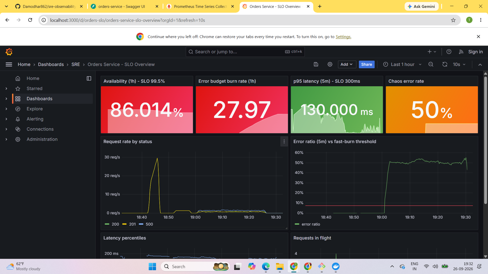
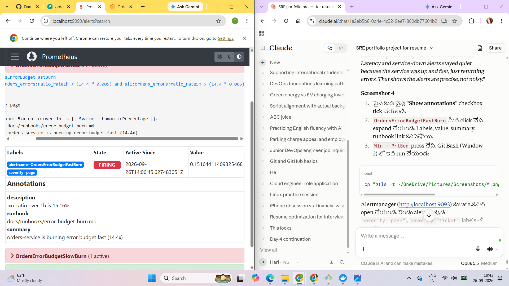
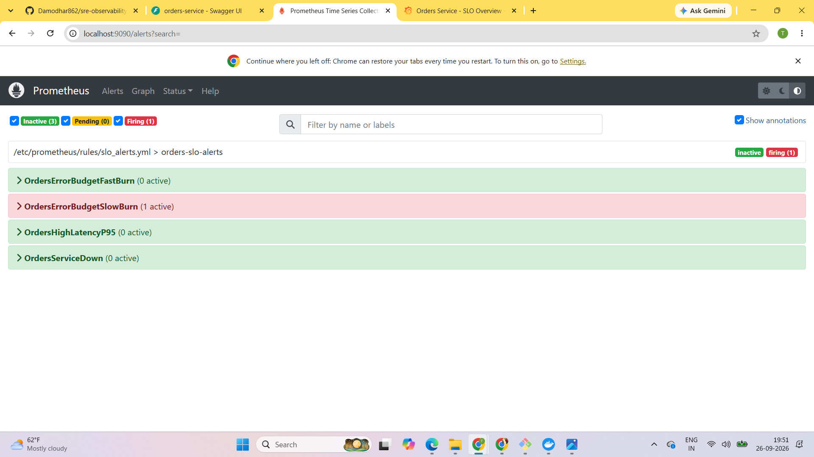

# SRE Observability Platform - SLO-based Monitoring & Incident Response

A production-style reliability setup for a Python microservice: **SLIs/SLOs, error budgets,
multi-window burn-rate alerting, Grafana dashboards, load testing, chaos experiments,
runbooks and blameless postmortems**, deployable with Docker Compose or Kubernetes.


## Architecture

```
            k6 load test / traffic.sh
                     |
                     v
   +----------------------------------+        scrape /metrics every 15s
   |  orders-service (FastAPI)        | <------------------------------+
   |  - /orders  /health  /ready      |                                |
   |  - /chaos  (fault injection)     |                        +---------------+
   |  - /metrics (Prometheus client)  |                        |  Prometheus   |
   +----------------------------------+                        | recording +   |
                                                               | alert rules   |
                                                               +-------+-------+
                                                                       |
                                              +------------------------+------------+
                                              v                                     v
                                       +-------------+                      +--------------+
                                       |   Grafana   |                      | Alertmanager | -> Slack (optional)
                                       | SLO dashboard|                     | routing,     |
                                       +-------------+                      | inhibition   |
                                                                            +--------------+
```

## Results

**Load test (k6, 20 concurrent users, ~41 req/s):** 9,902 requests, **0.00% errors**, **p95 114ms**, all SLO thresholds passed.

**Chaos game day:** injected a 50% error rate on `/orders`. Availability fell to ~85% and the burn rate rose to ~29x,
so both burn-rate alerts fired while the latency and service-down alerts correctly stayed quiet. The runbook led to the
cause, and the fast-burn alert resolved within minutes of mitigation. Full write-up: [docs/postmortem-example.md](docs/postmortem-example.md)

| Grafana SLO dashboard during the incident |
|---|
|  |

| Burn-rate alerts firing | Fast-burn alert resolved after the fix |
|---|---|
|  |  |

## SLOs
| SLI | SLO | Error budget |
|---|---|---|
| Availability of `/orders` | 99.5% | 0.5% |
| `/orders` latency < 300ms | 95% | 5% |

Details and alerting strategy: [docs/SLOs.md](docs/SLOs.md)

## Quick start (Docker Compose)
```bash
docker compose up -d --build
./scripts/traffic.sh            # in a second terminal, keeps data flowing
```
| Service | URL |
|---|---|
| App | http://localhost:8000/docs |
| Prometheus | http://localhost:9090 (Alerts tab) |
| Alertmanager | http://localhost:9093 |
| Grafana | http://localhost:3000 -> Dashboards -> SRE (anonymous access enabled for local demo only) |

## Load test
```bash
docker compose run --rm k6
```
The test **fails** if the service breaks its SLOs (thresholds: error rate < 0.5%, p95 < 300ms).

## Chaos game day
```bash
./scripts/chaos.sh errors 0.3     # 30% of requests fail
# watch: Grafana error ratio -> Prometheus alert pending -> firing (~5-10 min)
# follow docs/runbooks/error-budget-burn.md
./scripts/chaos.sh reset
./scripts/chaos.sh latency 600    # triggers OrdersHighLatencyP95
```
Write up what happened in a postmortem: [docs/postmortem-template.md](docs/postmortem-template.md)

## Kubernetes (kind)
```bash
kind create cluster --name sre
docker build -t orders-service:1.0 .
kind load docker-image orders-service:1.0 --name sre
kubectl apply -f k8s/namespace.yaml
kubectl apply -f k8s/
kubectl -n orders get pods
kubectl -n orders port-forward svc/orders-service 8080:80
```
Includes rolling updates with `maxUnavailable: 0`, readiness/liveness probes, resource limits,
non-root + read-only filesystem, a PodDisruptionBudget and an HPA
(HPA needs metrics-server: `kubectl apply -f https://github.com/kubernetes-sigs/metrics-server/releases/latest/download/components.yaml`;
on kind add `--kubelet-insecure-tls` to its args).

## CI (GitHub Actions)
On every push: unit tests -> `promtool` validates Prometheus config + SLO rules ->
`amtool` validates Alertmanager config -> image build -> container smoke test.

## Project structure
```
app/                     FastAPI service with Prometheus instrumentation + fault injection
tests/                   pytest unit tests
monitoring/prometheus/   scrape config, SLO recording rules, burn-rate alerts
monitoring/alertmanager/ routing, grouping, inhibition
monitoring/grafana/      provisioned datasource + SLO dashboard (dashboards as code)
loadtest/                k6 script with SLO thresholds
scripts/                 chaos.sh, traffic.sh
k8s/                     Deployment, Service, HPA, PDB
docs/                    SLOs, runbooks, postmortem template
```

## Run tests locally
```bash
python -m venv .venv && source .venv/bin/activate
pip install -r requirements-dev.txt
pytest -v
```
